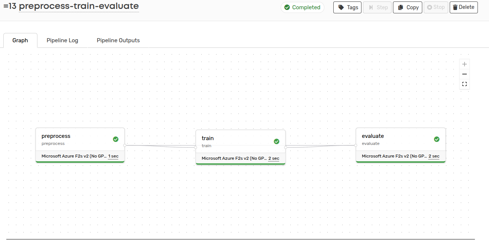
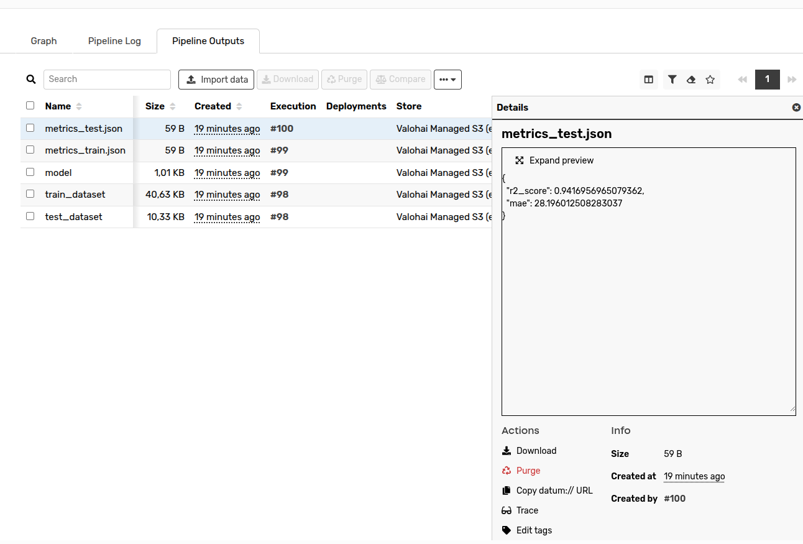

## Project Overview

I made this mini project to learn how to use of **Valohai** for building a machine learning pipeline to predict the fatigue strength of steel based on its composition and processing parameters. 

---

## Dataset

The dataset contains information about steel, including:
- Chemical composition 
- Processing parameters 
- Fatigue strength ,which is the target variable.

---

## Pipeline Workflow

The pipeline consists of three steps:

1. **Preprocess**: Splits the dataset into training and testing sets.
2. **Train**: Trains a linear regression model on the training data.
3. **Evaluate**: Evaluates the model on the test data and saves the metrics.

### Pipeline Visualization

